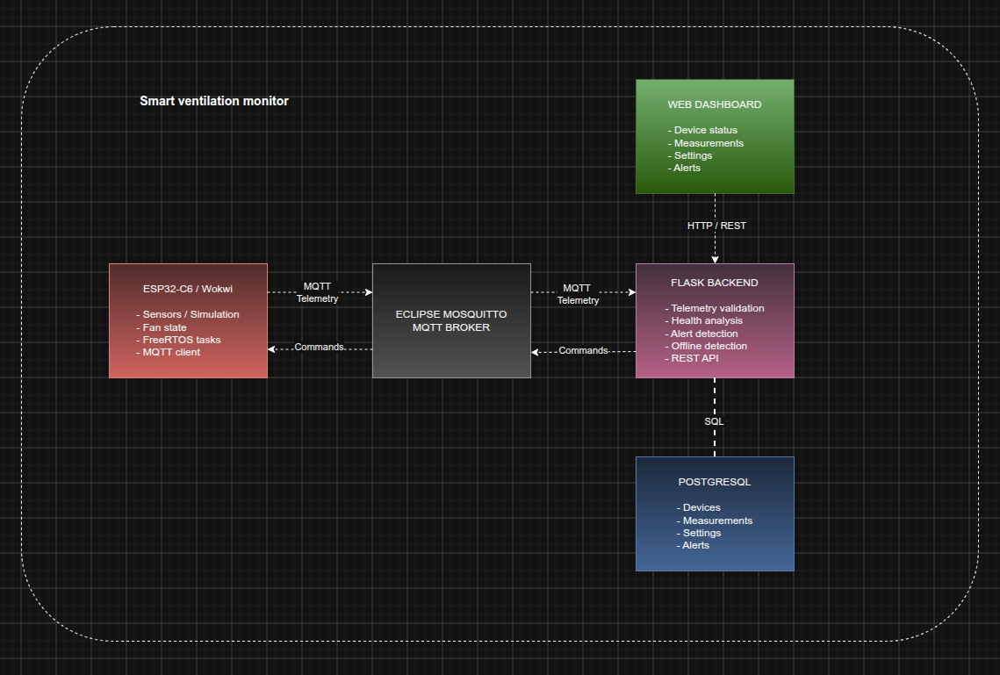

# Smart Ventilation Monitoring System

Smart Ventilation Monitoring System is an IoT-based prototype for monitoring the operational state and indoor environment of a ventilation system.

The project combines an ESP32-based edge device, MQTT communication, a Python/Flask backend, PostgreSQL, and a web dashboard to create an end-to-end monitoring system capable of collecting telemetry, storing historical measurements, detecting abnormal conditions, and remotely updating device settings.

> **Project status:** This project is a Minimum Viable Product (MVP) developed as a technical prototype.  
> The goal is to demonstrate the complete IoT architecture and core functionality rather than provide a production-ready ventilation monitoring product.

---

## Table of Contents

- [Project Overview](#project-overview)
- [MVP Scope](#mvp-scope)
- [System Architecture](#system-architecture)
- [System Flow](#system-flow)
- [Technology Stack](#technology-stack)
- [Why These Technologies?](#why-these-technologies)
- [Edge Device](#edge-device)
- [Ventilation Simulation](#ventilation-simulation)
- [MQTT Communication](#mqtt-communication)
- [Backend](#backend)
- [Health Analysis](#health-analysis)
- [Alerts](#alerts)
- [Offline Detection](#offline-detection)
- [Database](#database)
- [REST API](#rest-api)
- [Dashboard](#dashboard)
- [Docker](#docker)
- [Project Structure](#project-structure)
- [Getting Started](#getting-started)
- [Testing](#testing)
- [Reliability and Error Handling](#reliability-and-error-handling)
- [Current Limitations](#current-limitations)
- [Possible Future Development](#possible-future-development)

---

# Project Overview

The purpose of the project is to investigate how an IoT-based system can be used to monitor a ventilation unit over time.

Traditional monitoring of a ventilation system may only provide information about its current state. This prototype instead demonstrates how telemetry can be continuously collected, transmitted, stored, analyzed, and presented to a user.

The system currently monitors values such as:

- Temperature
- Relative humidity
- Fan speed (RPM)
- Fan running/stopped state
- Configured fan speed
- Device health status
- Device connectivity

The backend compares incoming telemetry against configured target values and can classify the device as:

- `HEALTHY`
- `WARNING`
- `CRITICAL`
- `OFFLINE`

Measurements and alerts are stored in PostgreSQL, allowing the system to retain historical information rather than only displaying the latest sensor reading.

---

# MVP Scope

This project is intentionally implemented as a **Minimum Viable Product (MVP)**.

The primary objective is to demonstrate a complete IoT data flow:

```text
Edge device
    ↓
Sensor / simulated data
    ↓
MQTT
    ↓
Backend processing
    ↓
Health analysis
    ↓
PostgreSQL
    ↓
REST API
    ↓
Web dashboard
```

The MVP focuses on proving that the different parts of the architecture can communicate reliably and that telemetry can be processed from the edge device all the way to the user interface.

The project is therefore **not intended to represent a complete commercial HVAC monitoring solution**.

Features such as advanced authentication, encrypted MQTT communication, cloud deployment, predictive maintenance, vibration analysis, advanced historical visualization, and large-scale device management are possible future extensions.

The architecture has been designed with separation between components so that additional functionality can be introduced without replacing the entire system.

---

# System Architecture

The system uses a modular IoT architecture with clearly separated responsibilities between the edge device, communication layer, backend, database, and user interface.

Telemetry flows from the ESP32 through the MQTT broker to the Flask backend, where it is validated, analyzed, and stored in PostgreSQL. Commands travel in the opposite direction through MQTT.

The web dashboard communicates exclusively with the Flask backend through the REST API and has no direct access to the database or edge device.

 

---

# System Flow

A normal telemetry cycle follows these steps:

1. The edge device reads or generates the current ventilation state.
2. The device creates a JSON telemetry message.
3. Telemetry is published to the MQTT broker.
4. The Flask backend subscribes to the telemetry topic.
5. The backend parses and validates the message.
6. The backend verifies that the device is known.
7. Device settings are retrieved from PostgreSQL.
8. The telemetry is analyzed against configured target values.
9. The device health status is updated.
10. Relevant alerts are generated.
11. The measurement is stored in PostgreSQL.
12. The dashboard retrieves the information through the REST API.

This separates the responsibilities of the different system components.

---

# Technology Stack

| Component | Technology |
|---|---|
| Edge hardware | ESP32-C6 |
| Embedded language | C++ |
| Embedded framework | ESP-IDF |
| Embedded build environment | PlatformIO |
| RTOS | FreeRTOS |
| Sensor | SHT30 temperature/humidity sensor |
| Edge simulation | Wokwi |
| IoT communication | MQTT |
| MQTT broker | Eclipse Mosquitto |
| MQTT payload format | JSON |
| Backend | Python |
| Web framework | Flask |
| MQTT client | Paho MQTT |
| Database | PostgreSQL 16 |
| Database driver | psycopg2 |
| Dashboard | HTML / CSS / JavaScript |
| Infrastructure | Docker / Docker Compose |
| Backend testing | pytest |

---

# Why These Technologies?

## ESP32-C6 and C++

The ESP32-C6 provides Wi-Fi connectivity and is suitable for embedded IoT applications.

C++ together with ESP-IDF gives the edge implementation direct access to the ESP32 networking stack, FreeRTOS, I2C communication, and MQTT functionality.

The edge implementation is structured into separate services and tasks rather than placing all functionality inside one main loop.

---

## FreeRTOS

ESP-IDF uses FreeRTOS for task scheduling.

The edge implementation uses separate tasks for responsibilities such as:

- Sensor acquisition
- Telemetry handling
- Command handling

Queues are used to transfer information between parts of the application.

This allows sensor acquisition, MQTT communication, and device control to operate as separate responsibilities instead of being tightly coupled together.

---

## MQTT

MQTT was selected as the primary communication protocol between the edge device and backend.

MQTT is well suited for IoT telemetry because it provides a lightweight publish/subscribe communication model.

Instead of the ESP32 directly calling the backend, both components communicate through the broker.

```text
ESP32 ──publish──► MQTT Broker ──► Backend
ESP32 ◄─subscribe─ MQTT Broker ◄── Backend
```

This creates loose coupling between the device and server.

The edge device does not need to know how telemetry is stored or analyzed. It only needs to know which MQTT topics to publish and subscribe to.

---

## Flask

Flask is used for the backend REST API.

It provides a lightweight way to expose device information, measurements, settings, and alerts to the dashboard while keeping the backend simple enough for an MVP.

The backend also runs the MQTT subscriber and offline monitoring logic.

---

## PostgreSQL

PostgreSQL is used for persistent storage.

A relational database was selected because the system contains clearly structured relationships between:

- Devices
- Measurements
- Device settings
- Alerts

Historical measurements can be stored and retrieved for later analysis.

This also makes it possible to extend the project with historical graphs, statistics, trend analysis, or predictive maintenance in future versions.

---

## Docker

Docker Compose is used to run the main server-side infrastructure.

The current Compose environment contains:

- PostgreSQL
- Eclipse Mosquitto
- Flask API
- Web dashboard

Using containers provides a reproducible local development environment and reduces differences between developers' machines.

---

## Wokwi

Wokwi is used to simulate an ESP32 environment during development.

This allows MQTT communication and device behaviour to be developed and tested without requiring physical hardware for every development task.

The repository also contains a separate ESP32-C6 implementation intended for the physical edge device.

---

# Edge Device

The edge layer is responsible for interacting with the ventilation unit and communicating with the rest of the system.

The repository currently contains two edge implementations:

```text
edge/
├── esp32-c6/
└── wokwi/
```

The Wokwi implementation provides a simulated development environment, while the `esp32-c6` implementation contains the more hardware-oriented ESP-IDF architecture.

---

## Physical ESP32-C6 Implementation

The ESP32-C6 implementation is divided into several modules:

```text
ESP32-C6
│
├── Wi-Fi service
├── MQTT service
├── SHT30 driver
├── Sensor task
├── Telemetry task
├── Command task
├── Fan simulator
└── FreeRTOS queues
```

This modular structure separates hardware access, communication, and application behaviour.

---

## SHT30 Sensor

The physical edge implementation contains a driver for the SHT30 temperature and humidity sensor.

The sensor communicates with the ESP32 through I2C.

The driver performs:

- I2C initialization
- Sensor discovery
- Measurement requests
- Temperature conversion
- Humidity conversion
- CRC validation

CRC validation is used to detect corrupted sensor data before it is accepted by the application.

---

# Ventilation Simulation

Because this project is an MVP, a complete physical ventilation system is not required.

Part of the ventilation behaviour can therefore be simulated.

The Wokwi implementation separates simulation state from MQTT communication.

Conceptually:

```text
simulation
    │
    ├── owns device state
    └── owns simulation settings
             │
             ▼
          MQTT layer
             │
             ▼
          Backend
```

The MQTT layer is responsible for communication, while the simulation is responsible for the current device state.

This prevents communication code from also becoming responsible for ventilation behaviour.

The physical ESP32-C6 implementation similarly contains a fan simulator that can represent fan behaviour based on configured settings.

---

# MQTT Communication

The project uses topic-based MQTT communication.

## Telemetry

Devices publish telemetry to:

```text
smartvent/{device_id}/telemetry
```

The backend subscribes using the wildcard topic:

```text
smartvent/+/telemetry
```

This means a single backend subscriber can receive telemetry from multiple ventilation units.

Example:

```text
smartvent/vent-001/telemetry
smartvent/vent-002/telemetry
smartvent/vent-003/telemetry
```

---

## Telemetry Payload

The current telemetry contract contains the measured state of the device.

Example:

```json
{
  "device_id": "vent-001",
  "temperature": 22.0,
  "humidity": 45.0,
  "fan_speed_rpm": 1450,
  "fan_status": "running"
}
```

The edge device reports actual device values.

Backend-owned configuration such as the stored fan speed setting is retrieved separately from the database when telemetry is processed.

This keeps measured telemetry and backend configuration logically separated.

---

## Commands

Devices subscribe to:

```text
smartvent/{device_id}/command
```

Example:

```text
smartvent/vent-001/command
```

A command can contain runtime settings such as:

```json
{
  "fan_speed_setting": 80,
  "measurement_interval": 10
}
```

The command allows device behaviour to be modified while the device is running.

A restart or firmware rebuild is therefore not required when these runtime settings change.

---

# Backend

The backend is implemented in Python using Flask.

Its responsibilities include:

- Providing the REST API
- Receiving MQTT telemetry
- Parsing JSON
- Validating incoming telemetry
- Checking whether devices are registered
- Loading device settings
- Determining device health
- Creating alerts
- Updating device status
- Storing measurements
- Detecting offline devices
- Publishing configuration commands to devices

The MQTT and HTTP interfaces therefore serve different purposes:

```text
MQTT
Edge device ↔ Backend

REST
Dashboard ↔ Backend
```

---

# Health Analysis

Incoming telemetry is analyzed against target values stored for each device.

The current implementation uses the following tolerance rules:

| Measurement | Allowed deviation |
|---|---:|
| Fan RPM | ±15% |
| Temperature | ±10% |
| Humidity | ±15% |

A normal device is classified as:

```text
HEALTHY
```

If a measurement falls outside the configured tolerance, the device can be classified as:

```text
WARNING
```

A clearly invalid or critical condition can result in:

```text
CRITICAL
```

For example, if the fan reports that it is running while the measured RPM is zero:

```text
fan_status = running
fan_speed_rpm = 0
```

the backend classifies the condition as `CRITICAL`.

---

## Sensor Sanity Checks

The backend also performs basic sanity checking of sensor values.

Current checks include:

```text
Temperature:   -50°C to 60°C
Humidity:       0% to 100%
Fan RPM:        >= 0
Fan status:     running | stopped
```

Values outside these ranges are considered invalid sensor data.

This provides a basic distinction between an unusual operating condition and clearly unreasonable sensor data.

---

# Alerts

The backend can generate alerts when abnormal conditions are detected.

Alerts contain:

- Device ID
- Severity
- Reason
- Timestamp

Current severity levels include:

```text
WARNING
CRITICAL
```

Examples include:

- Invalid sensor data
- Fan reported as running with zero RPM
- Temperature outside configured tolerance
- Humidity outside configured tolerance

Alerts are stored in PostgreSQL and can be retrieved through the REST API.

---

# Offline Detection

The backend runs an offline monitoring loop in a background thread.

Each time valid telemetry is processed, the device's `last_seen` timestamp is updated.

The offline monitor periodically checks whether devices have stopped reporting.

The current default behaviour marks a device as:

```text
OFFLINE
```

when no new telemetry has been received within the configured timeout.

This allows the system to distinguish between an unhealthy device that is still communicating and a device that has stopped communicating entirely.

---

# Device Lifecycle

Devices also contain a separate `lifecycle_status`.

Current values are:

```text
ACTIVE
OUT_OF_SERVICE
```

This is separate from the operational `status`.

Conceptually:

```text
status
    HEALTHY
    WARNING
    CRITICAL
    OFFLINE

lifecycle_status
    ACTIVE
    OUT_OF_SERVICE
```

The operational status describes the current condition of the device, while the lifecycle status can be used to determine whether the device should currently be considered part of the active system.

The current device listing returns devices whose lifecycle status is `ACTIVE`.

---

# Database

PostgreSQL contains four main tables:

```text
devices
measurements
settings
alerts
```

## Devices

Stores registered ventilation units and their current state.

Important fields include:

```text
device_id
name
status
lifecycle_status
last_seen
```

---

## Measurements

Stores historical telemetry.

Measurements include:

```text
device_id
temperature
humidity
fan_speed_setting
fan_speed_rpm
fan_status
health_status
created_at
```

---

## Settings

Stores configuration and target values for each device.

Current settings include:

```text
fan_speed_setting
measurement_interval
target_temperature
target_humidity
target_rpm
```

---

## Alerts

Stores detected abnormal conditions.

```text
device_id
severity
reason
created_at
```

---

# REST API

The Flask backend exposes the following endpoints.

## Health Check

```http
GET /health
```

Checks whether the API can connect to PostgreSQL.

Example response:

```json
{
  "status": "ok",
  "database": "ok"
}
```

---

## List Devices

```http
GET /devices
```

Returns active registered devices and their current status.

---

## Create Device

```http
POST /devices
```

Creates a new ventilation unit.

Example request:

```json
{
  "name": "Office Ventilation"
}
```

The backend automatically assigns a device ID and creates default settings for the device.

---

## Latest Measurement

```http
GET /devices/{device_id}/latest
```

Returns the latest stored measurement for a device.

---

## Measurement History

```http
GET /devices/{device_id}/measurements
```

Returns stored measurements for a device.

---

## Get Settings

```http
GET /devices/{device_id}/settings
```

Returns the current settings and target values for the device.

---

## Update Settings

```http
PUT /devices/{device_id}/settings
```

Updates runtime settings.

Example:

```json
{
  "fan_speed_setting": 80,
  "measurement_interval": 10
}
```

The backend stores the updated values and publishes an MQTT command to:

```text
smartvent/{device_id}/command
```

This creates the control flow:

```text
Dashboard
    ↓ HTTP PUT
Backend
    ↓ database update
PostgreSQL
    ↓
Backend
    ↓ MQTT command
ESP32
```

---

## Device Alerts

```http
GET /devices/{device_id}/alerts
```

Returns stored alerts for a device.

---

# Dashboard

The project includes a lightweight web dashboard implemented using HTML, CSS, and JavaScript.

The dashboard communicates with the Flask backend through the REST API.

It can display information such as:

- Registered devices
- Current device status
- Fan status
- Latest temperature
- Latest humidity
- Fan RPM
- Target values
- Alerts
- Device settings

The dashboard also allows runtime settings to be changed.

When settings are saved, the dashboard sends an HTTP request to the backend. The backend stores the new settings and forwards the relevant command to the edge device through MQTT.

The dashboard therefore does not communicate directly with the ESP32.

---

# Docker

The server-side application is orchestrated using Docker Compose.

The Compose configuration currently defines:

```text
db
broker
api
dashboard
```

The default exposed ports are:

| Service | Port |
|---|---:|
| MQTT | `1883` |
| REST API | `5001` |
| Dashboard | `8080` |

PostgreSQL is kept inside the Docker network and uses a persistent Docker volume.

---

# Project Structure

```text
smart-ventilation-monitor/
│
├── api/
│   ├── app.py
│   ├── mqtt.py
│   ├── db.py
│   ├── analysis.py
│   ├── alerts.py
│   ├── offline.py
│   ├── validation.py
│   └── tests/
│
├── dashboard/
│   ├── index.html
│   ├── app.js
│   ├── style.css
│   └── Dockerfile
│
├── database/
│   └── init.sql
│
├── edge/
│   ├── esp32-c6/
│   │   ├── include/
│   │   ├── src/
│   │   ├── test/
│   │   └── platformio.ini
│   │
│   └── wokwi/
│       ├── src/
│       ├── diagram.json
│       ├── platformio.ini
│       └── wokwi.toml
│
├── mosquitto/
│   └── mosquitto.conf
│
├── Docs/
│
├── docker-compose.yml
└── README.md
```

---

# Getting Started

## Requirements

For the Docker-based backend environment:

- Docker
- Docker Compose

For edge development:

- VS Code
- PlatformIO
- ESP-IDF compatible toolchain
- Wokwi extension for simulated development

---

## Start the Server-Side System

From the project root:

```bash
docker compose up --build -d
```

Check running containers:

```bash
docker compose ps
```

View API logs:

```bash
docker compose logs -f api
```

View broker logs:

```bash
docker compose logs -f broker
```

---

## Open the Dashboard

With the default configuration:

```text
http://localhost:8080
```

The REST API is available on:

```text
http://localhost:5001
```

For example:

```bash
curl http://localhost:5001/health
```

and:

```bash
curl http://localhost:5001/devices
```

---

## MQTT Testing

Telemetry can be observed using an MQTT client:

```bash
mosquitto_sub \
  -h localhost \
  -p 1883 \
  -t 'smartvent/+/telemetry' \
  -v
```

A command can be sent manually using:

```bash
mosquitto_pub \
  -h localhost \
  -p 1883 \
  -t 'smartvent/vent-001/command' \
  -m '{"fan_speed_setting":80,"measurement_interval":10}'
```

This is useful when testing command handling independently from the dashboard.

---

# Testing

The backend contains pytest tests for the health analysis logic.

Current test cases cover:

- Healthy operating conditions
- Warning conditions
- Critical fan conditions

Tests can be run inside the API container:

```bash
docker compose exec api python -m pytest -q
```

The project has also been tested through end-to-end flows such as:

```text
Edge telemetry
    ↓
MQTT broker
    ↓
Backend validation
    ↓
Health analysis
    ↓
PostgreSQL storage
```

and:

```text
Settings update
    ↓
Backend
    ↓
MQTT command
    ↓
Edge device
    ↓
Runtime configuration change
```

---

# Reliability and Error Handling

Several basic reliability mechanisms are implemented in the MVP.

## MQTT Connection State

The edge implementation tracks MQTT connection state and avoids publishing when the MQTT connection is unavailable.

---

## Wi-Fi Reconnection

The Wokwi ESP32 implementation attempts to reconnect when Wi-Fi connectivity is lost.

---

## Offline Detection

The backend marks devices as offline when telemetry has not been received within the configured timeout.

---

## Sensor Validation

Sensor values are checked for invalid or unreasonable values before being treated as normal operating data.

The physical SHT30 driver also validates sensor communication using CRC checks.

---

## Database Health Check

The `/health` endpoint verifies database connectivity and returns an error status if PostgreSQL cannot be reached.

---

## Persistent Storage

PostgreSQL uses a Docker volume so stored data survives normal container restarts.

---

# Current Limitations

As an MVP, the current implementation intentionally has several limitations.

## Security

The local MQTT broker currently allows anonymous connections:

```text
allow_anonymous true
```

MQTT communication is not currently protected with TLS.

The REST API also does not currently implement authentication or authorization.

These choices simplify local development but would not be suitable for a production deployment.

---

## Local Deployment

The current infrastructure is primarily designed for local development using Docker Compose.

There is currently no production cloud deployment or high-availability configuration.

---

## Basic Health Analysis

The current health analysis uses fixed tolerance-based rules.

It does not currently perform:

- Statistical anomaly detection
- Machine learning
- Long-term trend analysis
- Predictive maintenance

---

## Limited Historical Visualization

Measurements are stored historically, but the current dashboard focuses primarily on current device information and alerts.

Advanced historical graphs and trend visualization could be added later.

---

## Vibration Monitoring

Vibration monitoring was identified as a relevant feature for ventilation monitoring, but it is not part of the currently implemented telemetry contract in this MVP.

A future version could introduce an accelerometer or vibration sensor and extend the analysis model accordingly.

---

## Database Migrations

The current database is initialized using:

```text
database/init.sql
```

This works well when creating a new local database.

However, changing `init.sql` does not automatically update an already existing PostgreSQL Docker volume.

A production-oriented version should therefore use a database migration system to version and apply schema changes safely.

---

# Possible Future Development

The MVP provides a foundation that can be extended in several directions.

Possible future features include:

- Vibration monitoring using an accelerometer
- Historical graphs and trend visualization
- Predictive maintenance
- Long-term anomaly detection
- More advanced fault simulation
- MQTT authentication
- MQTT over TLS
- REST API authentication and authorization
- Device credentials and device identity
- Secure secret management
- Database migrations
- Cloud deployment
- Automated CI/CD
- Container orchestration
- Monitoring and observability
- Structured application logging
- Multiple physical ventilation units
- Remote device provisioning
- Over-the-air firmware updates
- More advanced lifecycle management
- Configurable alert thresholds
- Alert acknowledgement
- Notifications
- More extensive automated testing
- Load and scalability testing

The MQTT topic structure already includes the device identifier:

```text
smartvent/{device_id}/...
```

which provides a natural foundation for supporting multiple ventilation units.

---

# From MVP to Production

The current prototype demonstrates the core architecture:

```text
sense
  ↓
communicate
  ↓
validate
  ↓
analyze
  ↓
store
  ↓
present
  ↓
control
```

Moving toward a production system would require additional work in areas such as:

```text
Security
Reliability
Scalability
Observability
Deployment
Device management
Data analysis
Automated testing
```

The goal of the MVP is therefore not to solve every possible ventilation monitoring problem.

Instead, it demonstrates that an embedded IoT device, MQTT infrastructure, backend processing, persistent storage, and a user-facing dashboard can be combined into a functional end-to-end monitoring system.

---

# Summary

Smart Ventilation Monitoring System demonstrates an IoT architecture for monitoring and controlling a ventilation unit.

The project combines:

```text
ESP32-C6
+
SHT30
+
FreeRTOS
+
MQTT
+
Eclipse Mosquitto
+
Python / Flask
+
PostgreSQL
+
REST
+
Web Dashboard
+
Docker
```

The result is an MVP capable of collecting ventilation telemetry, communicating it through MQTT, analyzing device health, storing historical measurements and alerts, presenting information through a dashboard, and sending runtime configuration changes back to the edge device.

The modular architecture also provides a foundation for future development toward a more complete ventilation monitoring and predictive maintenance platform.
